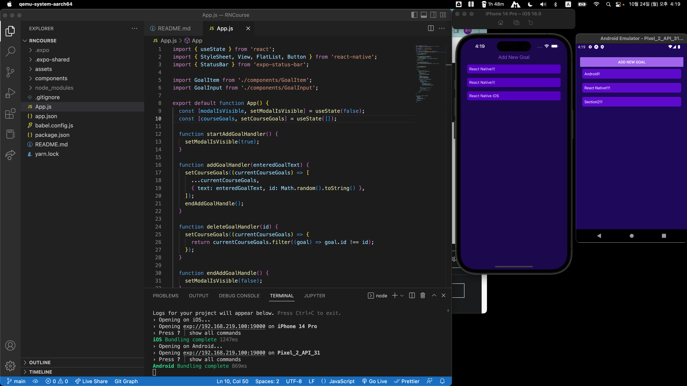

# RNCourse

React Native 강의(https://www.udemy.com/course/react-native-2022-ko/)를 듣고 따라하면서 관련 기록을 남깁니다.

# Section2

- flexbox가 자주 사용하는 스타일이라 default layout style 인건 편한 듯
- 컴포넌트가 stlye 상속이 없고 android, ios마다 적용되거나 적용되지 않는 style이 및 props가 있어 둘다 에뮬레이터를 띄워놓고 실행해야 할 듯
  

# Section4

- StyleSheet에 대해서 익숙해 지는 시간이었음
- RN 컴포넌트/API 뿐 아니라 Expo SDK/API에도 RN 개발하는데 필요한 내용들이 많이 있어 보임
- Text 컴포넌트간은 부모/자식 관계를 가질 수 있고 스타일이 상속될 수 있다.
- expo-app-loading이 deprecated되고 expo-splash-screen으로 바꾸는 것을 해보았다.

# Section 5

- Dimensions, useWindowDimensions를 이용하여 반응형으로 구현 가능
- Platform을 이용하여 플랫폼 구분 가능
- 파일 확장자(android, ios)를 이용하여 플랫폼 전용 코드를 작성 가능

# Section 6

- useLayoutEffect를 한 번도 사용하지 않았는데 어떨때 사용하는지 알 수 있었음
- React Navigation 즐찾 추가
- Drawer 수행 시 아래 에러 발생하면 강의에 나온 해결방법 말고 링크된 깃헙 이슈 답변으로 해결하는게 정답 인 듯  
  `Reanimated 2 failed to create a worklet, maybe you forgot to add Reanimated's babel plugin?`
  https://github.com/software-mansion/react-native-reanimated/issues/1875#issuecomment-1125706058

# Section 7

- React Context를 이용한 상태관리를 배움
